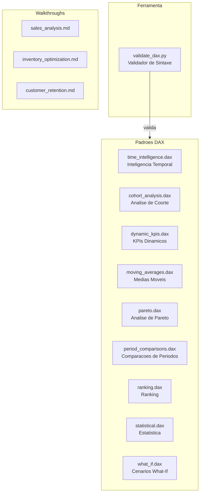
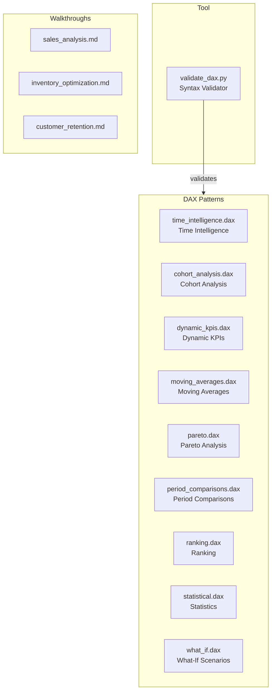

# Power BI DAX - Padroes Avancados de Analytics

Colecao de referencia com ~290 formulas DAX (Data Analysis Expressions) para Microsoft Power BI, organizadas em 9 categorias: inteligencia temporal, analise de coorte, KPIs dinamicos, medias moveis, Pareto, comparacoes de periodos, ranking, estatistica e cenarios what-if. Inclui um validador de sintaxe DAX em Python.

[](https://learn.microsoft.com/en-us/dax/)
[](https://python.org)
[](LICENSE)

[English](#english)

---

## Indice

- [Visao Geral](#visao-geral)
- [Categorias de Padroes](#categorias-de-padroes)
- [Estrutura do Projeto](#estrutura-do-projeto)
- [Validador de Sintaxe](#validador-de-sintaxe)
- [Exemplos de Uso](#exemplos-de-uso)
- [Como Usar](#como-usar)
- [Autor](#autor)

## Visao Geral

Este repositorio e uma biblioteca de consulta com formulas DAX prontas para uso em projetos Power BI. Cada arquivo `.dax` contem medidas comentadas e organizadas por tema, com explicacoes sobre quando e como usa-las.

Nao e uma aplicacao executavel — e material de referencia para analistas e desenvolvedores Power BI.

## Categorias de Padroes



| Arquivo | Descricao | Medidas |
|---------|-----------|---------|
| `time_intelligence.dax` | YTD, QTD, MTD, mesmo periodo ano anterior, ano fiscal | ~20 |
| `cohort_analysis.dax` | Retencao de clientes, analise de coorte por periodo de aquisicao | ~25 |
| `dynamic_kpis.dax` | KPIs com metas, semaforos, momentum, volatilidade, previsao linear | ~20 |
| `moving_averages.dax` | SMA, WMA, EMA aproximado, totais acumulados | ~15 |
| `pareto.dax` | Analise 80/20, contribuicao cumulativa, classificacao ABC | ~15 |
| `period_comparisons.dax` | Variacao percentual, crescimento sequencial, comparacao customizada | ~15 |
| `ranking.dax` | Top N, percentis, ranking dinamico, dense rank | ~20 |
| `statistical.dax` | Desvio padrao, correlacao, regressao, z-score, intervalos de confianca | ~20 |
| `what_if.dax` | Analise de sensibilidade, cenarios, ponto de equilibrio, Monte Carlo | ~15 |

## Estrutura do Projeto

```
powerbi-dax-advanced-analytics-patterns/
├── dax_patterns/
│   ├── time_intelligence.dax
│   ├── cohort_analysis.dax
│   ├── dynamic_kpis.dax
│   ├── moving_averages.dax
│   ├── pareto.dax
│   ├── period_comparisons.dax
│   ├── ranking.dax
│   ├── statistical.dax
│   └── what_if.dax
├── examples/
│   ├── sales_analysis.md
│   ├── inventory_optimization.md
│   └── customer_retention.md
├── data_model/
│   └── best_practices.md
├── tests/
│   └── validate_dax.py
├── LICENSE
└── README.md
```

## Validador de Sintaxe

O repositorio inclui um script Python (`tests/validate_dax.py`) que faz analise estatica basica dos arquivos `.dax`:

- Verifica parenteses, colchetes e chaves balanceados
- Detecta funcoes Excel inexistentes em DAX (`SUMIF`, `COUNTIF`, `AVERAGEIF`)
- Alerta sobre comparacao direta com `BLANK()` (sugere `ISBLANK()`)
- Alerta sobre uso do operador `/` (sugere `DIVIDE()`)
- Conta definicoes de medidas

```bash
# Validar todos os arquivos DAX
python tests/validate_dax.py dax_patterns/

# Saida detalhada
python tests/validate_dax.py dax_patterns/ -v

# Saida em JSON
python tests/validate_dax.py dax_patterns/ --json
```

Sem dependencias externas — usa apenas biblioteca padrao do Python.

## Exemplos de Uso

A pasta `examples/` contem tres walkthroughs detalhados que mostram como combinar os padroes DAX em cenarios reais:

- **sales_analysis.md** — Analise de vendas com YTD, ranking e tendencias
- **inventory_optimization.md** — Otimizacao de estoque com ABC, giro e previsao
- **customer_retention.md** — Retencao de clientes com coortes e LTV

## Como Usar

1. Abra o arquivo `.dax` da categoria desejada
2. Copie a medida para o Power BI Desktop (Home > New Measure)
3. Adapte os nomes de tabelas e colunas ao seu modelo de dados
4. Consulte `data_model/best_practices.md` para orientacoes sobre modelagem

## Autor

**Gabriel Demetrios Lafis**
- GitHub: [@galafis](https://github.com/galafis)
- LinkedIn: [Gabriel Demetrios Lafis](https://linkedin.com/in/gabriel-demetrios-lafis)

## Licenca

Este projeto esta licenciado sob a Licenca MIT - veja o arquivo [LICENSE](LICENSE) para detalhes.

---

## English

# Power BI DAX - Advanced Analytics Patterns

A reference collection of ~290 DAX (Data Analysis Expressions) formulas for Microsoft Power BI, organized in 9 categories: time intelligence, cohort analysis, dynamic KPIs, moving averages, Pareto, period comparisons, ranking, statistics, and what-if scenarios. Includes a Python-based DAX syntax validator.

### Overview

This repository is a reference library of ready-to-use DAX formulas for Power BI projects. Each `.dax` file contains commented and organized measures by theme, with explanations on when and how to use them.

This is not an executable application -- it is reference material for Power BI analysts and developers.

### Pattern Categories



| File | Description | Measures |
|------|-------------|----------|
| `time_intelligence.dax` | YTD, QTD, MTD, same period last year, fiscal year | ~20 |
| `cohort_analysis.dax` | Customer retention, cohort analysis by acquisition period | ~25 |
| `dynamic_kpis.dax` | KPIs with targets, traffic lights, momentum, volatility, linear forecast | ~20 |
| `moving_averages.dax` | SMA, WMA, approximate EMA, running totals | ~15 |
| `pareto.dax` | 80/20 analysis, cumulative contribution, ABC classification | ~15 |
| `period_comparisons.dax` | Percentage change, sequential growth, custom comparison | ~15 |
| `ranking.dax` | Top N, percentiles, dynamic ranking, dense rank | ~20 |
| `statistical.dax` | Standard deviation, correlation, regression, z-score, confidence intervals | ~20 |
| `what_if.dax` | Sensitivity analysis, scenarios, break-even, Monte Carlo | ~15 |

### Project Structure

```
powerbi-dax-advanced-analytics-patterns/
├── dax_patterns/
│   ├── time_intelligence.dax
│   ├── cohort_analysis.dax
│   ├── dynamic_kpis.dax
│   ├── moving_averages.dax
│   ├── pareto.dax
│   ├── period_comparisons.dax
│   ├── ranking.dax
│   ├── statistical.dax
│   └── what_if.dax
├── examples/
│   ├── sales_analysis.md
│   ├── inventory_optimization.md
│   └── customer_retention.md
├── data_model/
│   └── best_practices.md
├── tests/
│   └── validate_dax.py
├── LICENSE
└── README.md
```

### Syntax Validator

The repository includes a Python script (`tests/validate_dax.py`) that performs basic static analysis on `.dax` files:

- Checks balanced parentheses, brackets, and braces
- Detects Excel functions that don't exist in DAX (`SUMIF`, `COUNTIF`, `AVERAGEIF`)
- Warns about direct comparison with `BLANK()` (suggests `ISBLANK()`)
- Warns about `/` operator usage (suggests `DIVIDE()`)
- Counts measure definitions

```bash
# Validate all DAX files
python tests/validate_dax.py dax_patterns/

# Verbose output
python tests/validate_dax.py dax_patterns/ -v

# JSON output
python tests/validate_dax.py dax_patterns/ --json
```

No external dependencies -- uses Python standard library only.

### Usage

1. Open the `.dax` file for the desired category
2. Copy the measure into Power BI Desktop (Home > New Measure)
3. Adapt table and column names to your data model
4. See `data_model/best_practices.md` for data modeling guidance

### License

This project is licensed under the MIT License - see the [LICENSE](LICENSE) file for details.
